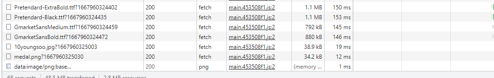
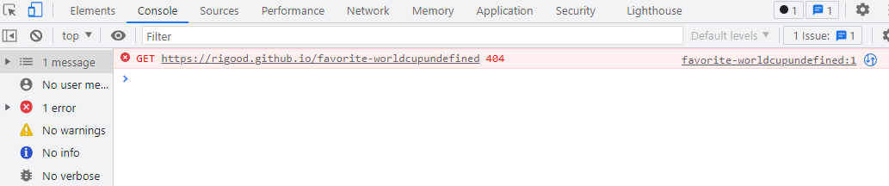

# 🏆 이상형 월드컵 (나는솔로 ver)

- [Demo 바로가기](https://rigood.github.io/favorite-worldcup)
- **토너먼트 형식으로 나는솔로 출연진 중 자신의 이상형을 고르는 게임**

 

## 💻 프로젝트

- 2022년 11월 5일 ~ 9일 (개인 프로젝트)

 

## 📌 주요 기능

- **게임 진행방식 선택**

  - [x] 총 라운드 선택 (32강, 16강, 8강)
  - [x] 출연진(이상형) 성별 선택 (여자, 남자, 성별무관)
  - [x] 사용자 닉네임 입력 가능

- **이상형 월드컵 게임**

  - [x] 나는솔로 출연진을 랜덤 추출하여 1:1 매치
  - [x] 현재 라운드, 진행중인 단계 표시

- **최종 결과 확인 및 공유**
  - [x] 이상형 이미지 저장 가능
  - [x] 카카오톡 링크 공유 가능

 

## ✅ 업데이트 기록

- [x] **최종 결과 페이지에 색종이 파티클 효과 추가 (11/15 완료)**
  - react-canvas-confetti 라이브러리 사용

 

- [x] **이미지 로딩 속도 개선 (4/24 완료)**
  - png -> jpg 파일로 변환하여 용량 줄이기

 

- [x] **다음 라운드 진출 시 하단에 알림 표시 (4/24 완료)**
  - react-toastify로 토스트 메시지 표시

 

- [ ] **이미지 다운로드 기능 브라우저 호환성 체크**
  - `html-to-image`는 safari에서 이미지 렌더링 기능을 지원하지 않음
  - 사용자 브라우저 확인 후 safari에서는 다운로드 버튼을 숨길 예정

 

- [ ] **웹폰트 서브셋 작업 후 프로젝트에 적용**

 

- [ ] **게임 진행 단계 막대 bar로 표현**

 

## 🔨 사용 기술

- React.js
- react-router-dom
- styled-components
- html-to-image
- react-canvas-confetti

 

## 🔍 구현 방법

- 재사용 가능한 `Radio` 컴포넌트를 구현하여 게임 진행방식을 입력 받음
- `useContext`를 이용하여 총 라운드, 출연진 성별, 닉네임 state를 전역적으로 관리
- `useEffect`를 이용하여 라운드가 시작되면 랜덤으로 후보 추출
- `useState`를 이용하여 후보, 렌더링 될 후보, 승자 배열의 state 관리
- `카카오톡 공유 API`를 통해 링크 공유 기능 구현
- `html-to-image` 라이브러리 사용하여 DOM을 이미지로 저장

 

## 🚑 문제 해결

- **깃허브 배포했으나 빈 화면만 뜨는 문제**

  - 원인: BrowserRouter에 기본 URL을 지정해주지 않음
  - 해결: createBrowserRouter에 basename 추가

 

- **서브페이지에서 새로고침 하는 경우 404 not found 에러 발생**

  - 원인: 깃허브 배포는 SPA를 지원하지 않기 때문에 서버가 index.html 외 다른 페이지는 인식하지 못함
  - 해결: 서브페이지 url을 변환하여 index.html로 redirect 시켜주는 스크립트를 404.html에 추가

 

- **`html-to-image` 을 통한 이미지 다운로드 속도가 너무 느림**

   

  

   

  - 원인: 이미지로 변환할 DOM에 CSS를 적용하기 위해 프로젝트 내 모든 웹폰트를 다운받게 되는데, CDN을 통해 해당 폰트들을 가져올 때 오랜 시간이 소요됨 (약 10초)

  - 해결: 기본 폰트 사용 (추후 서브셋폰트 다운 받아 css 적용 예정)

 
 

- **Winner 페이지에서 GET 요청 undefined 404 에러 발생**

 

  

 

- 원인
  - winner 이미지 GET 요청에 대한 404 에러로 확인됨
  - 컴포넌트가 초기 렌더링 되는 시점에는 winner 상태값이 존재하지 않음(undefined)
  - useEffect를 통해 데이터를 받아온 후 winner 상태값을 설정하는데, useEffect는 컴포넌트가 초기 렌더링 된 후 실행됨
- 해결
  - winner 값이 존재하지 않는 경우 로딩 문구를 렌더링하도록 코드 수정
  - winner 값이 설정된 이후 GET 요청을 하기 때문에 에러 발생X

 
 

- **모바일 환경(삼성 인터넷 브라우저)에서 이미지 다운로드가 되지 않음**
  - 원인
    - USB 디버깅 확인 결과, 이미지 파일은 정상이었으나
    - 브라우저에 자동 다운로드 차단 기능이 설정되어 있었음
  - 해결: 자동 다운로드 차단 해제 후 정상 다운로드 확인

 

- **모바일에서 버튼 클릭 시 hover 스타일이 남아 있는 문제**
  - 원인: 모바일 등 터치스크린 환경에서는 요소를 터치한 후 다른 요소를 터치하기 전까지 계속 hover 상태가 유지됨
  - 해결
    - 최상위 컴포넌트에서 터치스크린 여부를 판단(isTouchScreen)
    - useContext를 통해 isTouchScreen 값을 다른 컴포넌트에서도 참조
    - isTouchScreen을 styled-component의 props로 전달하여 터치스크린일 경우에만 hover 스타일을 적용함
